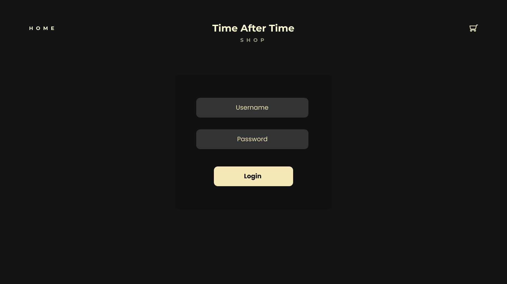
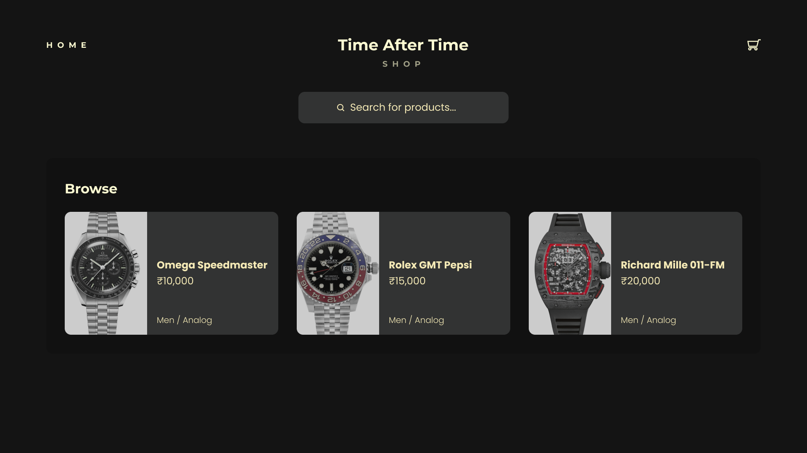
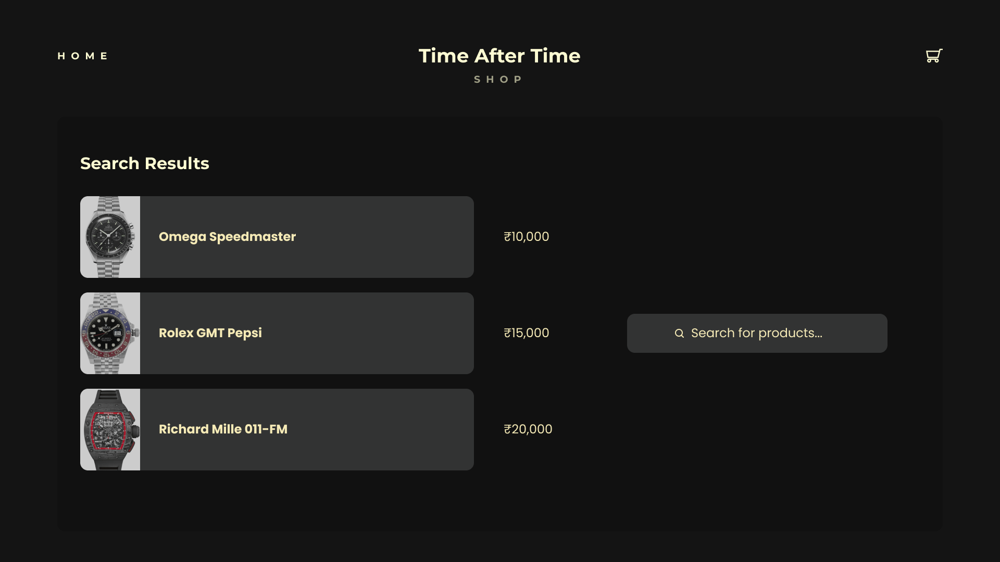
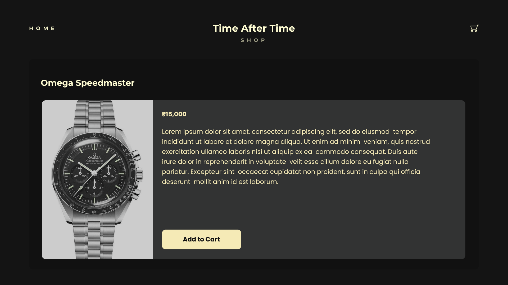
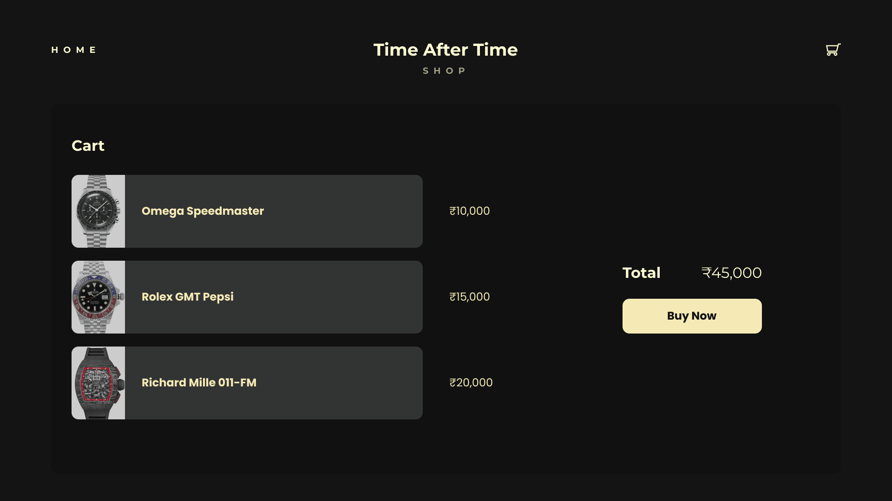
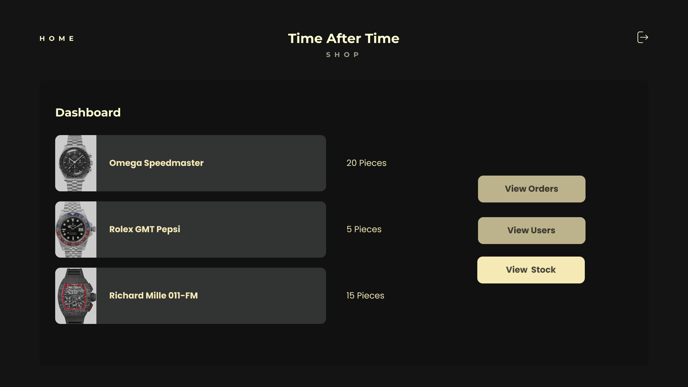

# Time After Time

> Final Project for CSE202 (Fundamentals of Database Management Systems), made by Vaibhav Chopra, Paarth Goyal, Ishir Bhardawj, and Namit Bhadana.

## Overview

This e-commerce platform allows users to browse, search, and purchase products online. Built using React, MySQL, Flask (Python 3), HTML, CSS, and JavaScript, it provides a seamless shopping experience with various user-friendly features.

## Features

- **Sign Up**: Customers can create an account with a password for a personalized shopping experience.
- **Login**: Customers can log in using their mobile number and password. Cart functionality is enabled upon login.<br>
  
- **Browse and Search Products**: Customers can browse a product catalog, view details such as price, availability, images, and active offers, and add items to their cart. Products can also be searched by name.<br>
  
  
  
- **Cart**: Customers can add products to their cart and adjust the quantity of each item.<br>
  
- **Place Order**: Customers can place orders for items in their cart, and the total amount will be deducted from their balance.
- **Assign Delivery Executive**: After an order is placed, a delivery executive is assigned, and order updates are sent to the customer.
- **Admin Dashboard**: An admin dashboard provides various statistics regarding item quantities, stock, and more.<br>
  

## Technology Stack

- **Backend**: MySQL, Flask (Python 3)
- **Frontend**: HTML, CSS, JavaScript, React

## Setup

```sh
python -m venv virt
cd virt\scripts
activate
set FLASK_APP=hello.py
flask run
```

## Development

The branch test2 is used for development of the react app.
